# 🎨 ArtifexLab (Frontend)

  <strong>A curated digital art space where creators showcase artworks and learn through tutorials.</strong> 
  Built with <strong>React</strong>, <strong>React Bootstrap</strong>, and a <strong>Django REST Framework</strong> API.

  <h3 align="center">✨ Create. Inspire. Mentor. ✨</h3>

- 🌐 **Live site:** [ArtifexLab](https://artifexlabs-21d35e2775bc.herokuapp.com/)
- 💻 **Frontend repo:** [ArtifexLab Frontend](https://github.com/SamAtkinsonModeste/artifexlab)
- ⚙️ **Backend API:** [ArtifexLab API](https://github.com/SamAtkinsonModeste/artifexlab-api)

---

  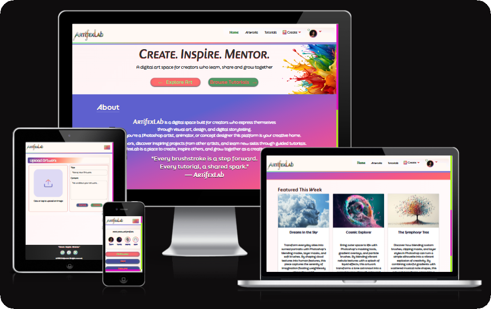

---

## 📖 Table of Contents

1. [Project Overview](#project-overview)
2. [User Stories](#-user-stories)
3. [UX & Design](#ux--design)
4. [Features](#features)
5. [Frontend Architecture](#frontend-architecture)
6. [API Integration](#api-integration)
7. [Tech Stack](#tech-stack)
8. [Testing](#testing)
9. [Known Issues & Future Enhancements](#known-issues--future-enhancements)
10. [Agile Process](#agile-process)
11. [Credits](#credits)

---

## 🖼️ Project Overview

ArtifexLab is a friendly, modern space for **digital artists** to share work, discover inspiration, and follow guided **tutorials**.
Users can register, edit a profile, post artworks, comment, like, and explore a growing tutorials library (custom feature).
This project uses **two GitHub repos** (frontend + backend) and is deployed to **Heroku**.

**Target Users:**
Digital artists, learners, and mentors who want to share and grow creatively in a collaborative space.

🔵⬆️ [**Back to top**](#-table-of-contents)

---

## 👥 User Stories

This project was developed using an **Agile methodology** with **MoSCoW prioritisation**,
managed through GitHub Projects to plan, track, and deliver each feature incrementally.

👉 You can view the complete Agile board and backlog here:
[**ArtifexLab Frontend GitHub Project**](https://github.com/users/SamAtkinsonModeste/projects/20/views/1)

### 🎯 Core User Goals

ArtifexLab is designed to give creators and learners a seamless, inspiring experience.
From showcasing digital art to exploring educational tutorials, users can connect, learn, and grow together.

### 💡 Key User Stories

As a **Registered User**, I can:

- 🎨 **Upload new artworks** with titles, descriptions, and images to share my creations.
- ✏️ **Edit or delete my own artworks** to keep my portfolio current and polished.
- 💬 **Comment on and like other users’ artworks** to engage and interact within the community.
- 🧠 **Create tutorials** that include a description, feature image, and multiple **steps**.
  - Each step can optionally include its own **image**, providing visual guidance.
- 👁️ **View tutorials created by others** to learn new techniques and creative approaches.
- 💚 **Follow other artists** to see their latest works and tutorials appear in my personalised feed.
- 👤 **Manage my own profile** by updating my avatar and bio to reflect my creative identity.

As an **Unregistered Visitor**, I can:

- 👀 **Browse artworks and tutorials** to explore the community’s content.
- 🔑 **Register for an account** to gain access to interactive features like posting, liking, and following.

These stories guided the frontend and backend build of ArtifexLab and were continually refined through Agile iterations and feedback from mentors.

🔵⬆️ [**Back to top**](#-table-of-contents)

## 🎨 UX & Design

### ✨ Branding

ArtifexLab embodies creativity, mentorship, and community through its simple yet expressive branding.
The project tagline — **“Create. Inspire. Mentor.”** — captures the platform’s collaborative mission.

### 🖋️ Typography

Three typefaces were selected from **Adobe Fonts** to establish a distinctive yet readable style across all viewports:

| Font                    | Usage                                                 | Visual Style                                                 |
| ----------------------- | ----------------------------------------------------- | ------------------------------------------------------------ |
| **pinot-grigio-modern** | Used for the **ArtifexLab** site name on the homepage | Elegant, artistic display font adding character to the logo  |
| **FinalSix**            | Applied to all **headings and body text**             | Rounded geometric sans-serif that feels modern and confident |
| **bc-alphapipe**        | Used for **Navbar links** and interactive labels      | Sleek, futuristic font that complements the creative theme   |

Together, these fonts balance personality with legibility, supporting both expressive headlines and user-friendly reading experiences.

### 🎨 Color Palette

The color palette was designed using a **light/base/dark system** with primary, secondary, and CTA accents.
Each color was tested for contrast and visual harmony against both white and dark backgrounds.

| Role                        | Hex Code  | Description                                              |
| --------------------------- | --------- | -------------------------------------------------------- |
| 🕊️ **White Base**           | `#FFF9F4` | Warm off-white background used for main content areas    |
| ⚫ **Black Base**           | `#2E2E2E` | Deep neutral text color ensuring strong readability      |
| 💜 **Primary Accent**       | `#5E60CE` | Core brand color (used for buttons, icons, and headings) |
| 💚 **Secondary Accent**     | `#80ED99` | Fresh complementary hue used sparingly for highlights    |
| ❤️ **Call to Action (CTA)** | `#FF6B6B` | Bold brand color for interactive elements and alerts     |

These colors work harmoniously to convey creativity and energy without overwhelming the user.
The combination of purple and coral provides contrast between inspiration and action,
while the soft off-white background keeps the interface balanced and approachable.

  
<strong>🎨 Open to view color palette and font samples</strong>

   

  

    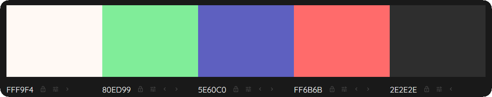
  

  

    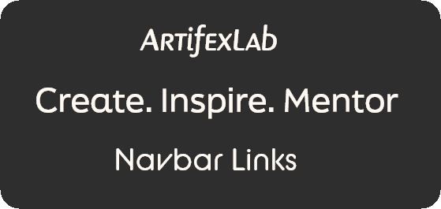
  

  

    <em>Font sample preview:</em> 
    <strong style="font-family: 'pinot-grigio-modern';">ArtifexLab</strong> 
    Create. Inspire. Mentor. 
    Navbar Links
  

### ♿ Accessibility

All color choices were checked for **WCAG contrast compliance**.
The layout uses **semantic HTML**, focus-visible states, and consistent color cues for interaction and feedback.

🔵⬆️ [**Back to top**](#-table-of-contents)

### Wireframes: Adobe XD mockups for Mobile & Homepage.

  

  
<strong>🖼️ Open to view wireframes</strong>

   

  

    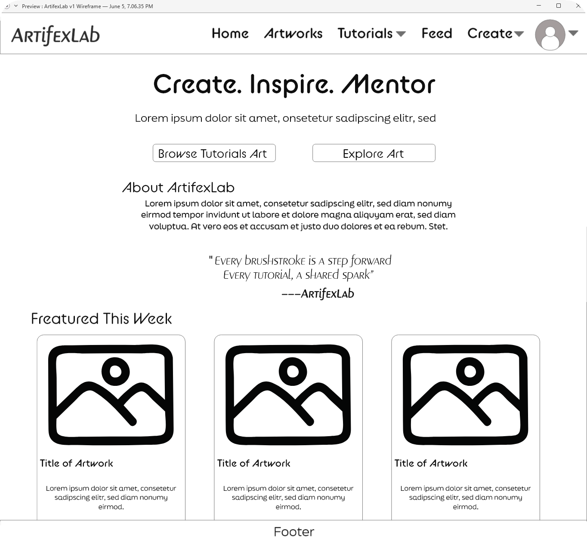
  

  

    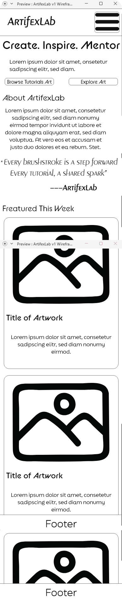
  

🔵⬆️ [**Back to top**](#-table-of-contents)

---

## ⚡ Features

### 🌐 Navigation

The **Navbar** is a responsive Bootstrap component that adapts for desktop and mobile views.
It remains fixed at the top of the page for easy access to key site areas.

### 📱 Mobile Navigation

On smaller screens, the Navbar collapses into a **hamburger menu** using Bootstrap’s built-in responsive behaviour.
When the menu is toggled open, each navigation link is revealed with a smooth **fade-in transition** —
creating a subtle cascading effect as the dropdown expands.

This transition helps maintain visual clarity on mobile while giving the menu a more polished, app-like feel.
All links remain large and easily tappable, improving accessibility and touch usability.
The mobile Navbar also ensures that dropdowns for **Create** and **Profile** are accessible,
retaining their respective options (Create Artwork, Create Tutorial, View Profile, Edit Profile, Logout)
for logged-in users.

  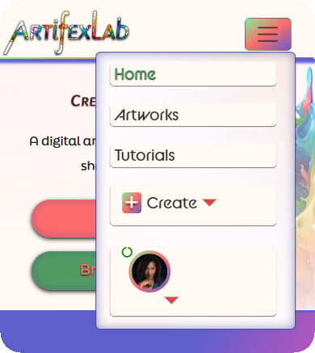

When **logged out**, users see limited navigation options:

- **Home**
- **Artworks**
- **Tutorials**
- **Sign In**
- **Sign Up**

  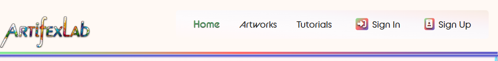

When **logged in**, the Navbar expands to include:

- **Home**
- **Artworks**
- **Tutorials**
- **Create** (Dropdown)
- **Profile** (Dropdown)

  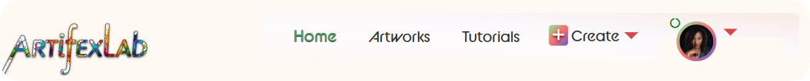

### 🎨 Create Dropdown

The **Create** dropdown is visible **only to logged-in users**.
It provides quick access to add new content without navigating through multiple pages:

- ➕ **Create Artwork** – opens the Artwork Create Form.
- 🧠 **Create Tutorial** – opens the Tutorial Create Form.

This dropdown enhances workflow by allowing creators to jump straight into content creation from any page.

  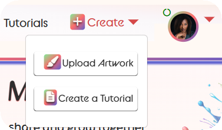

### 👤 Profile Dropdown

The **Profile** dropdown is also only visible to authenticated users.
It displays the user’s **avatar** (or default profile image) and offers two key options as well as Siging Out:

- 👀 **View Profile** – navigates to the user’s own profile page (`/profiles/:id`).
- ✏️ **Edit Profile** – takes the user to their profile edit form (`/profiles/:id/edit`).

This setup mirrors common social media UX patterns, ensuring familiarity and quick navigation for logged-in users.

  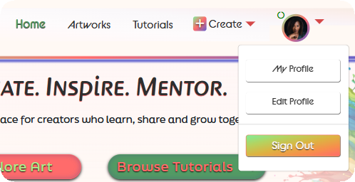

---

### 🏠 Home

- Hero banner with project tagline and introduction.
- **Callout buttons** linking directly to **Artworks** and **Tutorials** pages.

  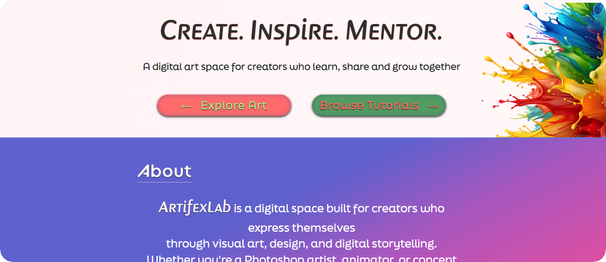

---

### 🖌️ Artworks

- List & detail views showing uploaded artwork posts.
- Create/Edit forms with clear field validation and success/error feedback.
- Like ❤️ and comment 💬 interactions using reusable patterns.

#### Artwork List View

  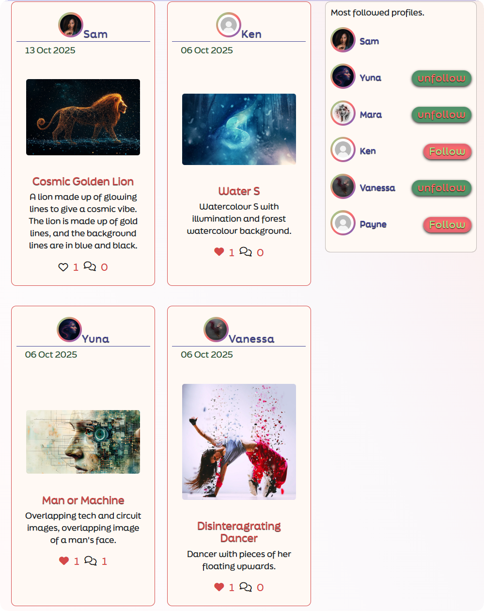

#### Artwork Detail View

  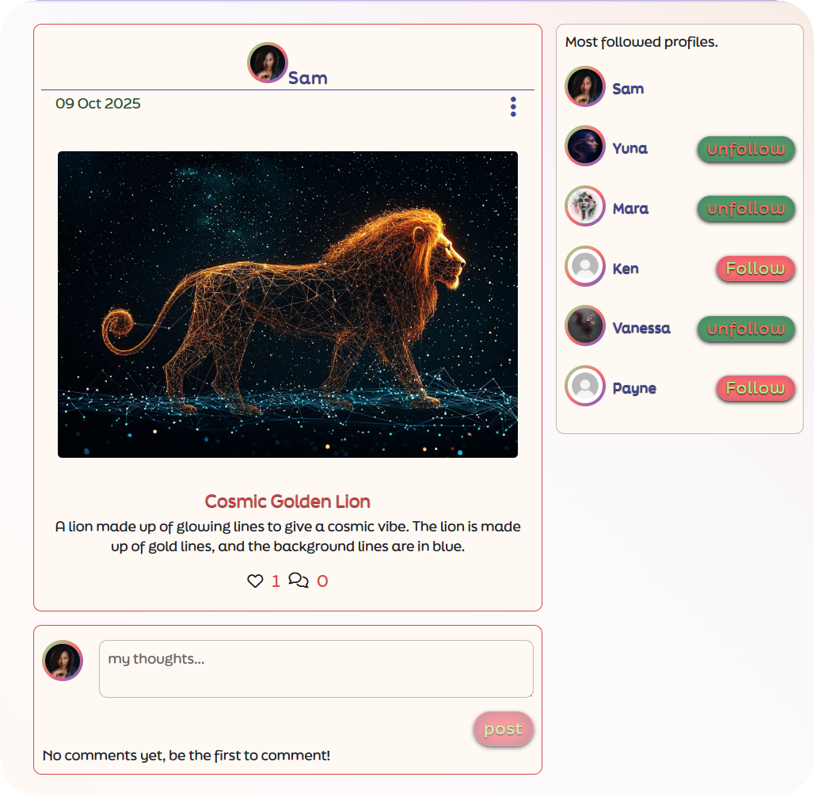

#### Artwork Create View

  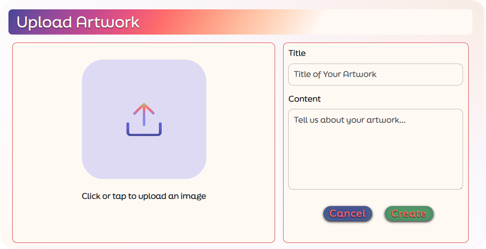

#### Artwork Edit View

  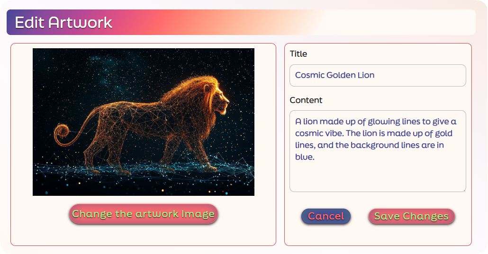

---

### 📚 Tutorials (Custom Feature)

- List & detail views for learning content created by users.
- Comments integrated on each tutorial page.
- Reuses image preview and inline delete confirmation patterns.

  

  

---

### 👤 Profiles

- View & edit profile information (avatar, bio).
- Sidebar shows **Most Followed Profiles** for discovery.

  

  

---

### 🚨 Feedback & Errors

- Reusable **FieldAlerts** for success, warning, and error messages.
- Custom **404 page** featuring an Eye artwork background.

  

---

### ♻️ Reusable Components

- Consistent **form patterns**, global styling, and optional infinite scrolling for feeds.

🔵⬆️ [**Back to top**](#-table-of-contents)

---

## 🧩 Frontend Architecture

### 🗺️ Routes

| Path                  | Purpose         |
| --------------------- | --------------- |
| `/`                   | Home            |
| `/artworks/`          | Artwork list    |
| `/artworks/:id`       | Artwork detail  |
| `/artworks/:id/edit`  | Edit artwork    |
| `/tutorials/`         | Tutorials list  |
| `/tutorials/:id`      | Tutorial detail |
| `/tutorials/:id/edit` | Edit tutorial   |
| `/profiles/:id`       | Profile detail  |
| `/profiles/:id/edit`  | Profile edit    |
| `*`                   | Page Not Found  |

### ⚙️ Components & Pages

- Clear separation between **pages (views)** and **reusable components** like Navbar, FieldAlerts, and SidePanel.
- Each section imports styling from modular CSS for maintainability.

### 🧠 State & Forms

- Local component state manages form fields.
- Validation and visual feedback via **FieldAlerts**.

### 🌐 Networking

- **Axios** instance handles API requests to the DRF backend with authentication headers preconfigured.

🔵⬆️ [**Back to top**](#-table-of-contents)

---

## 🔗 API Integration

- **Backend:** Django REST Framework using **dj-rest-auth + JWT**.
- **Filtering / Searching / Ordering:** Managed through query parameters (e.g. `?ordering=-created_at`, `?search=portrait`).
- **Pagination:** DRF pagination consumed by infinite scroll or “Load more” features.
- **Dates:** Rendered using human-friendly times (e.g., `naturaltime`).
- **Environment variable (production):**

`TODO: confirm API base URL`

🔵⬆️ [**Back to top**](#-table-of-contents)

---

## 🛠️ Tech Stack

- ⚛️ **React** (Create React App)
- 🧭 **React Router**
- 💅 **React Bootstrap** + Bootstrap utility classes
- 🌍 **Axios** for API calls
- 🐙 **GitHub** for version control & project management
- ☁️ **Heroku** for deployment

🔵⬆️ [**Back to top**](#-table-of-contents)

---

## 🧪 Testing

A brief summary of key test areas is below.
Full details, screenshots, and results are available in **[TESTING.md](./TESTING.md)**.

### ✅ Manual Testing

- Navigation: verified all routes load and redirect correctly.
- Auth: signup, login, logout tested end-to-end.
- CRUD: create, edit, and delete Artworks and Tutorials.
- Forms: validation errors display accurately.
- Responsiveness: tested on mobile, tablet, and desktop.
- 404 Handling: unknown routes redirect to custom 404 page.

### 🌐 Devices & Browsers

| Device  | Browser                    | Result |
| ------- | -------------------------- | ------ |
| Desktop | Chrome, Firefox, Edge      | ✅     |
| Mobile  | iOS Safari, Android Chrome | ✅     |

**Pass Criteria:**
All main user flows work correctly, no blocking console errors, and the frontend targets the correct API.

🔵⬆️ [**Back to top**](#-table-of-contents)

---

## 🧭 Known Issues & Future Enhancements

### 🐛 Known Issues

- **Resource-level 404:** When a valid route has a non-existent ID (e.g. `/artworks/999`), a fallback to the 404 component will be added later.

### 🌱 Future Enhancements

- Add **Feed filters** (e.g., My Feed, Favourites, Popular).
- Enable **video uploads** for Tutorials.
- Generate **downloadable PDFs** for Tutorials.
- Extend account settings to include username/password updates.

🔵⬆️ [**Back to top**](#-table-of-contents)

---

## 🌀 Agile Process

- **Methodology:** Agile development using **MoSCoW** prioritisation.
- **Tools:** Trello for planning, GitHub Projects for implementation.
- **Commits:** Followed **Conventional Commit** style for clarity.
- **User Stories:** Stored in GitHub Issues with labels for epics and priorities.

👉 See [**AGILE.md**](./AGILE.md) for full story breakdowns and prioritisation.

🔵⬆️ [**Back to top**](#-table-of-contents)

---

## 💖 Credits

Heartfelt thanks to:

- 🧑‍🏫 **Rory Patrick Sheridan** — mentor for Projects 1–4
- 🧑‍💻 **Richard** — mentor for Project 5 (final)
- 👨‍👩‍👧‍👦 **My family, especially my kids** — for their patience when mummy wasn’t as available ❤️

**Libraries & Tools:** React, React Router, Bootstrap/React Bootstrap, Axios, Heroku.
**Inspiration:** adapted patterns from the Code Institute **Moments** walkthrough.

🔵⬆️ [**Back to top**](#-table-of-contents)
