# 🎨 ArtifexLab (Frontend)

  <strong>A curated digital art space where creators showcase artworks and learn through tutorials.</strong> 
  Built with <strong>React</strong>, <strong>React Bootstrap</strong>, and a <strong>Django REST Framework</strong> API.

  <h3 align="center">✨ Create. Inspire. Mentor. ✨</h3>

- 🌐 **Live site:** [ArtifexLab](https://artifexlabs-21d35e2775bc.herokuapp.com/)
- 💻 **Frontend repo:** [ArtifexLab Frontend](https://github.com/SamAtkinsonModeste/artifexlab)
- ⚙️ **Backend API:** [ArtifexLab API](https://github.com/SamAtkinsonModeste/artifexlab-api)

---

  

---

## 📖 Table of Contents

1. [🎨 Project Overview](#-project-overview)
2. [👥 User Stories](#-user-stories)
3. [🎨 UX & Design](#-ux--design)
   - [🖋️ Typography](#️-typography)
   - [🎨 Color Palette](#-color-palette)
4. [⚙️ Features](#️-features)
   - [🏠 Home](#-home)
   - [🌐 Navigation](#-navigation)
   - [📱 Mobile Navigation](#-mobile-navigation)
   - [📚 Tutorials (Custom Feature)](#-tutorials-custom-feature)
   - [🎨 Artworks](#-artworks)
   - [👤 Profile](#-profile)
   - [👥 Followers Component](#-followers-component)
   - [🔎 Filters & Search (Artworks & Tutorials)](#-filters--search-artworks--tutorials)
   - [🔗 Footer](#-footer)
   - [🚨 Feedback & Errors](#-feedback--errors)
   - [🚫 404 Page](#-404-page)
   - [♻️ Reusable Components](#️-reusable-components)
5. [🏗️ Frontend Architecture](#️-frontend-architecture)
6. [🔗 API Integration](#-api-integration)
7. [🧰 Tech Stack](#-tech-stack)
8. [🧪 Testing](#-testing)
9. [🧭 Known Issues & Future Enhancements](#-known-issues--future-enhancements)
10. [⚡ Agile Process](#-agile-process)
11. [🙏 Credits](#-credits)

---

## 🖼️ Project Overview

ArtifexLab is a friendly, modern space for **digital artists** to share work, discover inspiration, and follow guided **tutorials**.
Users can register, edit a profile, post artworks, comment, like, and explore a growing tutorials library (custom feature).
This project uses **two GitHub repos** (frontend + backend) and is deployed to **Heroku**.

**Target Users:**
Digital artists, learners, and mentors who want to share and grow creatively in a collaborative space.

🔵⬆️ [**Back to top**](#-table-of-contents)

---

**Docs quick links:**

- 🧠 Backend repo: **[artifexlab-api](https://github.com/SamAtkinsonModeste/artifexlab-api)**
- 🔧 Backend Deployment: **[DEPLOYMENT.md](https://github.com/SamAtkinsonModeste/artifexlab-api/blob/main/DEPLOYMENT.md)**
- 🗂️ Backend Agile notes: **[AGILE.md](https://github.com/SamAtkinsonModeste/artifexlab-api/blob/main/AGILE.md)**

---

## 👥 User Stories

This project was developed using an **Agile methodology** with **MoSCoW prioritisation**,
managed through GitHub Projects to plan, track, and deliver each feature incrementally.

👉 You can view the complete Agile board and backlog here:
[**ArtifexLab Frontend GitHub Project**](https://github.com/users/SamAtkinsonModeste/projects/20/views/1)

### 🎯 Core User Goals

ArtifexLab is designed to give creators and learners a seamless, inspiring experience.
From showcasing digital art to exploring educational tutorials, users can connect, learn, and grow together.

### 💡 Key User Stories

As a **Registered User**, I can:

- 🎨 **Upload new artworks** with titles, descriptions, and images to share my creations.
- ✏️ **Edit or delete my own artworks** to keep my portfolio current and polished.
- 💬 **Comment on and like other users’ artworks** to engage and interact within the community.
- 🧠 **Create tutorials** that include a description, feature image, and multiple **steps**.
  - Each step can optionally include its own **image**, providing visual guidance.
- 👁️ **View tutorials created by others** to learn new techniques and creative approaches.
- 💚 **Follow other artists** to see their latest works and tutorials appear in my personalised feed.
- 👤 **Manage my own profile** by updating my avatar and bio to reflect my creative identity.

As an **Unregistered Visitor**, I can:

- 👀 **Browse artworks and tutorials** to explore the community’s content.
- 🔑 **Register for an account** to gain access to interactive features like posting, liking, and following.

These stories guided the frontend and backend build of ArtifexLab and were continually refined through Agile iterations and feedback from mentors.

🔵⬆️ [**Back to top**](#-table-of-contents)

---

## 🎨 UX & Design

### ✨ Branding

ArtifexLab embodies creativity, mentorship, and community through its simple yet expressive branding.
The project tagline — **“Create. Inspire. Mentor.”** — captures the platform’s collaborative mission.

### 🖋️ Typography

Three typefaces were selected from **Adobe Fonts** to establish a distinctive yet readable style across all viewports:

| Font                    | Usage                                                 | Visual Style                                                 |
| ----------------------- | ----------------------------------------------------- | ------------------------------------------------------------ |
| **pinot-grigio-modern** | Used for the **ArtifexLab** site name on the homepage | Elegant, artistic display font adding character to the logo  |
| **FinalSix**            | Applied to all **headings and body text**             | Rounded geometric sans-serif that feels modern and confident |
| **bc-alphapipe**        | Used for **Navbar links** and interactive labels      | Sleek, futuristic font that complements the creative theme   |

Together, these fonts balance personality with legibility, supporting both expressive headlines and user-friendly reading experiences.

### 🎨 Color Palette

The color palette was designed using a **light/base/dark system** with primary, secondary, and CTA accents.
Each color was tested for contrast and visual harmony against both white and dark backgrounds.

| Role                        | Hex Code  | Description                                              |
| --------------------------- | --------- | -------------------------------------------------------- |
| 🕊️ **White Base**           | `#FFF9F4` | Warm off-white background used for main content areas    |
| ⚫ **Black Base**           | `#2E2E2E` | Deep neutral text color ensuring strong readability      |
| 💜 **Primary Accent**       | `#5E60CE` | Core brand color (used for buttons, icons, and headings) |
| 💚 **Secondary Accent**     | `#80ED99` | Fresh complementary hue used sparingly for highlights    |
| ❤️ **Call to Action (CTA)** | `#FF6B6B` | Bold brand color for interactive elements and alerts     |

These colors work harmoniously to convey creativity and energy without overwhelming the user.
The combination of purple and coral provides contrast between inspiration and action,
while the soft off-white background keeps the interface balanced and approachable.

  
<strong>🎨 Open to view color palette and font samples</strong>

   

  

    
  

  

    
  

  

    <em>Font sample preview:</em> 
    <strong style="font-family: 'pinot-grigio-modern';">ArtifexLab</strong> 
    Create. Inspire. Mentor. 
    Navbar Links
  

### ♿ Accessibility

All color choices were checked for **WCAG contrast compliance**.
The layout uses **semantic HTML**, focus-visible states, and consistent color cues for interaction and feedback.

🔵⬆️ [**Back to top**](#-table-of-contents)

---

### Wireframes: Adobe XD mockups for Mobile & Homepage.

  

  
<strong>🖼️ Open to view wireframes</strong>

   

  

    
  

  

    
  

🔵⬆️ [**Back to top**](#-table-of-contents)

---

## ⚡ Features

### 🌐 Navigation

The **Navbar** is a responsive Bootstrap component that adapts for desktop and mobile views.
It remains fixed at the top of the page for easy access to key site areas.

### 📱 Mobile Navigation

On smaller screens, the Navbar collapses into a **hamburger menu** using Bootstrap’s built-in responsive behaviour.
When the menu is toggled open, each navigation link is revealed with a smooth **fade-in transition** —
creating a subtle cascading effect as the dropdown expands.

This transition helps maintain visual clarity on mobile while giving the menu a more polished, app-like feel.
All links remain large and easily tappable, improving accessibility and touch usability.
The mobile Navbar also ensures that dropdowns for **Create** and **Profile** are accessible,
retaining their respective options (Create Artwork, Create Tutorial, View Profile, Edit Profile, Logout)
for logged-in users.

  

When **logged out**, users see limited navigation options:

- **Home**
- **Artworks**
- **Tutorials**
- **Sign In**
- **Sign Up**

  

When **logged in**, the Navbar expands to include:

- **Home**
- **Artworks**
- **Tutorials**
- **Create** (Dropdown)
- **Profile** (Dropdown)

  

### 🎨 Create Dropdown

The **Create** dropdown is visible **only to logged-in users**.
It provides quick access to add new content without navigating through multiple pages:

- ➕ **Create Artwork** – opens the Artwork Create Form.
- 🧠 **Create Tutorial** – opens the Tutorial Create Form.

This dropdown enhances workflow by allowing creators to jump straight into content creation from any page.

  

### 👤 Profile Dropdown

The **Profile** dropdown is also only visible to authenticated users.
It displays the user’s **avatar** (or default profile image) and offers two key options as well as Signing Out:

- 👀 **View Profile** – navigates to the user’s own profile page (`/profiles/:id`).
- ✏️ **Edit Profile** – takes the user to their profile edit form (`/profiles/:id/edit`).

This setup mirrors common social media UX patterns, ensuring familiarity and quick navigation for logged-in users.

  

🔵⬆️ [**Back to top**](#-table-of-contents)

---

### 🏠 Home

The **Home page** welcomes visitors to ArtifexLab with a striking **Hero banner** that captures the site’s creative spirit and message —
a digital art space for creators to **Create, Inspire, and Mentor** one another.

The Hero section features clear **callout buttons** that invite visitors to explore the two core areas of the platform:
🎨 **Artworks** and 🧠 **Tutorials**.
This gives newcomers an immediate pathway to discover and engage with the community’s content.

  

Just below the Hero, the **About section** introduces the purpose and ethos of ArtifexLab.
It briefly explains the site’s mission — to provide a collaborative space where artists can showcase their work,
learn new techniques, and connect through creativity.
Visitors are encouraged to register or sign in to take part in the community.

  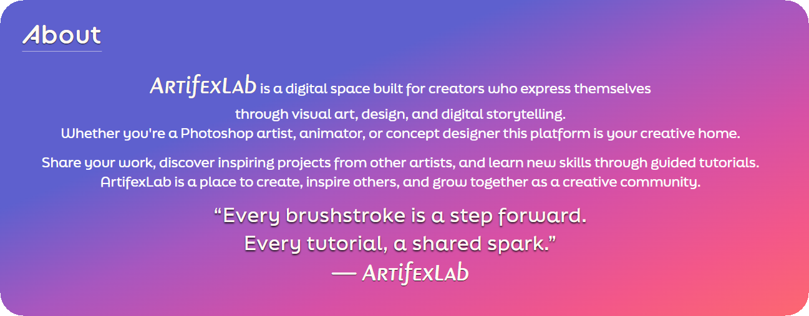

Following the About section, the **Featured Artwork area** offers a quick visual snapshot of the creativity happening within the platform.
This curated section highlights a selection of user artworks — from digital paintings to conceptual pieces —
giving new visitors an instant feel for the diversity and quality of art being produced on ArtifexLab.
It’s a showcase designed to inspire, while encouraging users to dive deeper into the main Artworks feed.

  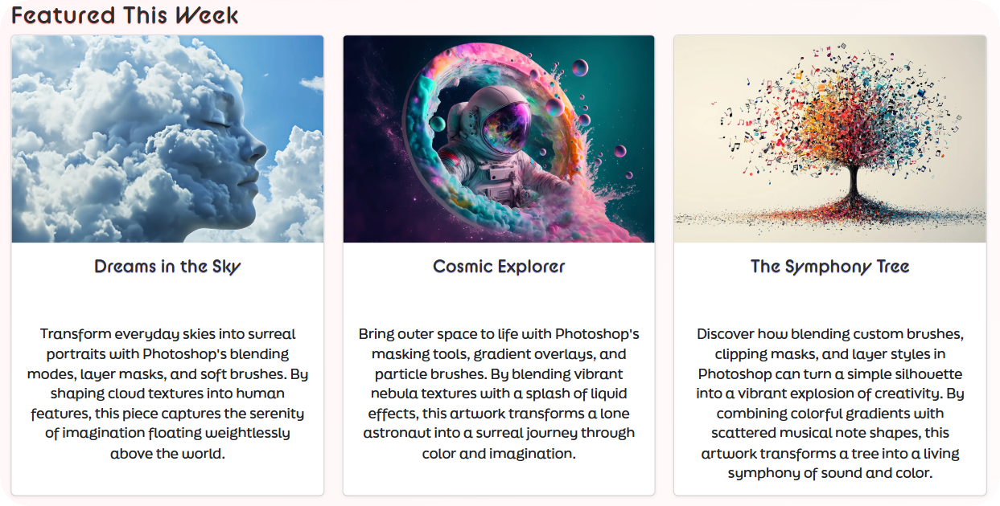

  
<strong>🖼️ Open to view all sections of Home page screenshot</strong>

   

  

    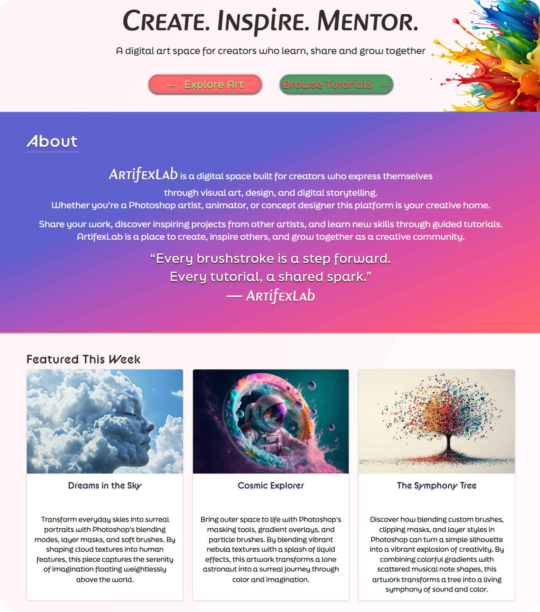
  

🔵⬆️ [**Back to top**](#-table-of-contents)

---

### 🖌️ Artworks

- List & detail views showing uploaded artwork posts.
- Create/Edit forms with clear field validation and success/error feedback.
- Like ❤️ and comment 💬 interactions using reusable patterns.

#### Artwork List View

  

#### Artwork Detail View

  

#### Artwork Create View

  

#### Artwork Edit View

  

🔵⬆️ [**Back to top**](#-table-of-contents)

---

### 📚 Tutorials (Custom Feature)

The **Tutorials** feature is the standout custom element that sets ArtifexLab apart as a community share site.
It allows creators to share educational content in a structured, visual, and interactive way — ideal for artists who want to **teach their creative process** step by step.

#### ✨ Create Tutorial

From the **Create dropdown** in the Navbar, logged-in users can access the **Tutorial Create Form**.
The form includes fields for a **title**, **feature image**, and a **description**, as well as the option to **add multiple tutorial steps**.

  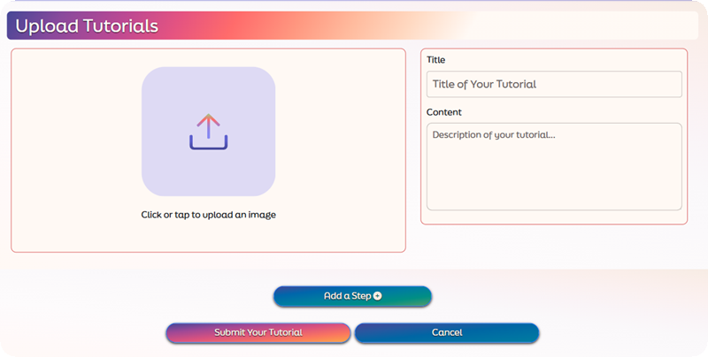

When the “Add Step” button is clicked, a new **step form dynamically appears** — revealing input fields for the step’s text and optional step image.
Each step can include an image preview, providing creators with instant visual feedback before saving.

This flexible design gives users creative control while maintaining a simple, guided workflow.

  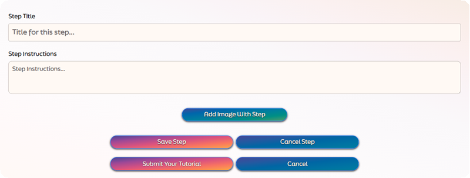

#### 🖼️ Tutorial Detail View

Each tutorial opens to a **detail view** that displays:

- The **feature image** at the top for strong visual impact.
- The **title** and **description** for context.
- A list of **tutorial steps** below, shown in the order they were added.

Logged-in users who own the tutorial will see three dots once clicked a dropdown menu appears with **edit and delete buttons** where they are taken to the edit page where they can edit:

- The main tutorial fields (title, description, feature image).
- Individual steps — allowing updates to images.

There is also a Delete button after the list of steps to delete the entire tutorial.

This inline edit experience makes maintaining tutorials quick and intuitive.
Other users can like ❤️ and comment 💬 on tutorials just like artworks, helping teachers receive feedback and engagement.

  
<strong>🖼️ Open to view Tutorial Edit Page</strong>

   

#### Tutorial Detail View

  

    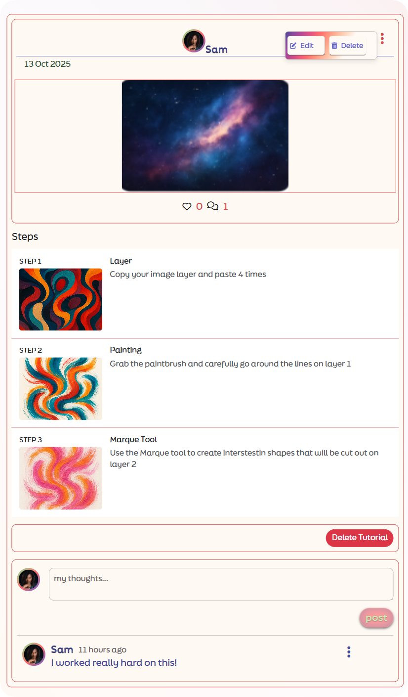
  

#### Tutorial Edit Steps

  

    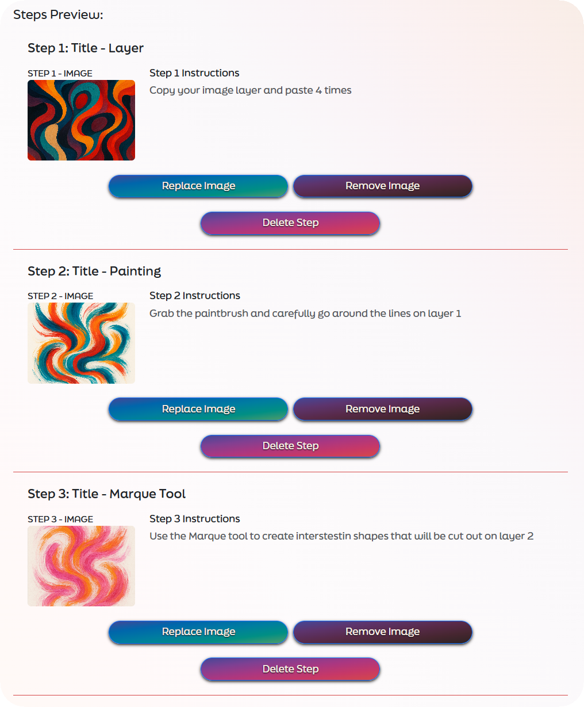
  

#### 🧩 Reusable Patterns

The tutorials feature reuses core UI patterns from artworks:

- **FieldAlerts** for success, warning, and error feedback.
- **Image preview logic** for uploads.
- **Inline confirmation prompts** for safe deletions.

Together, these ensure a consistent and reliable user experience across all creation and editing workflows.

🔵⬆️ [**Back to top**](#-table-of-contents)

---

### 👤 Profile

Each user has their own **Profile page** that acts as a personal hub — showcasing their creative activity and giving them control over their account settings.

At the top of the page, the user’s **profile image** is displayed prominently beside key stats:

- 🎨 **Artworks** — total number of artworks created by the user.
- 👥 **Followers** — how many people are following the user.
- 💚 **Following** — how many profiles the user follows.

This immediate visual summary gives a snapshot of the user’s engagement and presence within the ArtifexLab community.

  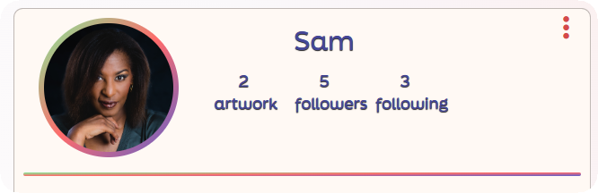

Below the header, users can scroll through all of the **artworks they’ve created**, displayed in the same card format as the main Artworks feed.
Each piece links to its own detail page, allowing users to revisit, edit, or delete their posts.
This setup creates a familiar, scrollable gallery of their creative journey.

  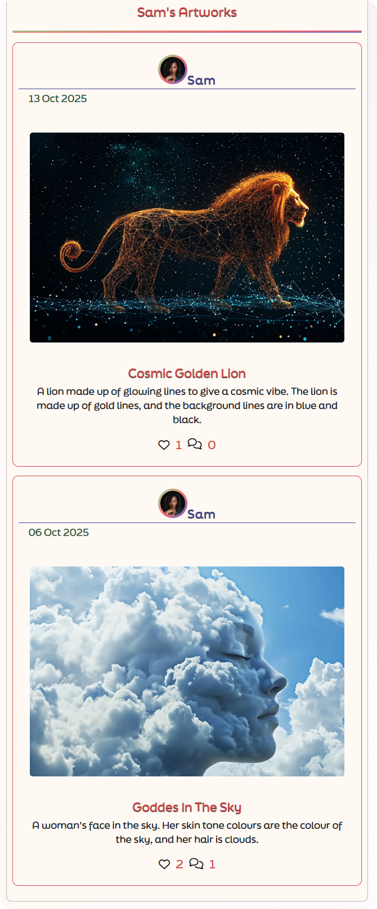

In the top-right corner of the profile header sits a subtle **three-dot dropdown menu** (⋮).
This menu provides quick access to important account management options:

- ✏️ **Edit Profile** – update bio or profile image.
- 🪪 **Change Username** – modify display name while retaining existing content.
- 🔒 **Change Password** – update login credentials securely.

These controls ensure users can manage their identity and privacy without navigating away from their profile.

  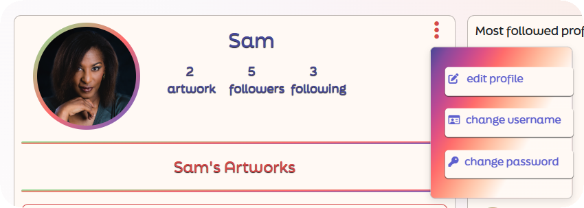

  
<strong>🖼️ Open to view entire Profile screenshot</strong>

   

  

    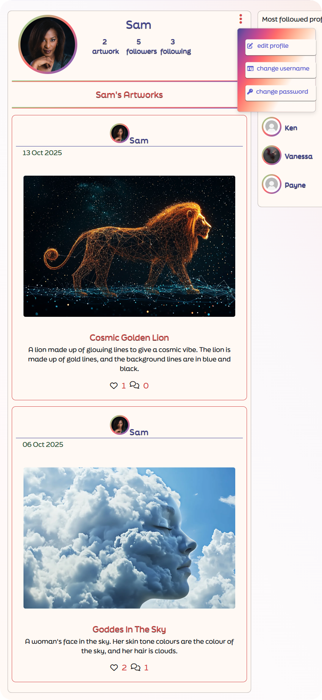
  

🔵⬆️ [**Back to top**](#-table-of-contents)

---

### 👥 Followers Component

The **Followers component** is a reusable side panel that appears on almost every main page across ArtifexLab —
including the **Artworks**, **Tutorials**, and **Profile** pages.
Its purpose is to make community connection effortless by giving users a quick way to discover and follow other artists.

At the top, the panel displays a small title such as **“Most Followed Profiles”**, followed by a list of user avatars and usernames.
Each entry includes a **Follow / Unfollow button** for logged-in users to interact with instantly — no need to navigate away from the current page.

To maintain intuitive UX, the **Follow button is hidden for the logged-in user’s own profile**,
ensuring that users only see actionable follow options for other members.

  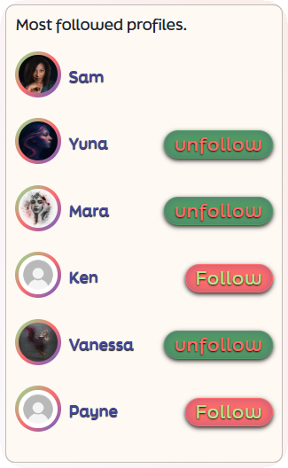

This consistent placement of the component encourages social interaction throughout the browsing experience — whether viewing an artwork or reading a tutorial.

  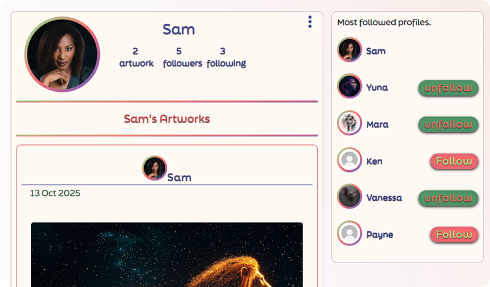

🔵⬆️ [**Back to top**](#-table-of-contents)

---

### 🔎 Filters & Search (Artworks & Tutorials)

Both the **Artworks** and **Tutorials** list pages include a **filter navigation bar** positioned directly above the results.
This bar helps users quickly refine what they see without leaving the page.

**Shared controls**

- 🔍 **Search**: type to filter by keywords in titles/descriptions/usernames.
- ↕️ **Order**: sort by **Newest**, **Oldest**, or **Most liked** (where applicable).
- 📱 **Responsive**: on smaller screens, filters stack vertically with comfortable tap targets and preserved spacing.

**Common quick filters**

- 🧑‍🤝‍🧑 **Following**: show content from profiles you follow.
- ❤️ **Liked**: show artworks you’ve liked.
- ⭐ **All**: show all Artwork or Tutorials.

#### Artworks page Filters

  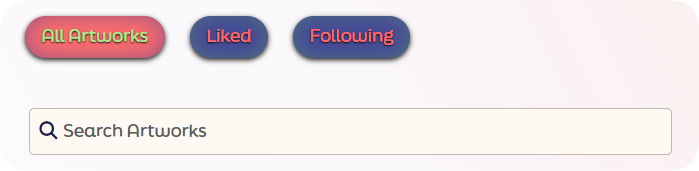

#### Tutorials page Filters

  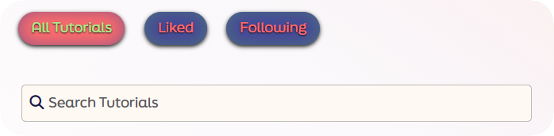

🔵⬆️ [**Back to top**](#-table-of-contents)

---

### 🔗 Footer

The **Footer** provides a clean and consistent ending to every page of ArtifexLab.
It stays visually light so it doesn’t compete with the artwork and tutorials above,
but still reinforces brand identity through consistent typography and spacing.

At the centre of the footer sits the **ArtifexLab** tagline
**“Create. Inspire. Mentor.”** to remind visitors of the platform’s ethos.

Beneath it, a row of **social media icons** links to ArtifexLab’s official profiles:

- 📸 **Instagram** — connect with artists sharing their work on social media.
- 🕊️ **X (Twitter)** — stay updated on announcements and community highlights.
- 📘 **Facebook** — join longer-form creative discussions and event updates.

All icons open in new tabs (`target="_blank" rel="noopener noreferrer"`) for accessibility and security.
The icons themselves are provided by **Font Awesome** and use hover color transitions for subtle interactivity.

  

On smaller screens, the layout remains single-row with compact icon sizing; icons scale down cleanly so no stacking layout is required at this time.

  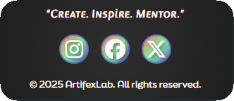

🔵⬆️ [**Back to top**](#-table-of-contents)

---

### 🚨 Feedback & Errors

A consistent feedback system runs throughout ArtifexLab, ensuring users always understand what’s happening as they interact with forms and pages.

#### 🔑 Sign In & Sign Up

Both authentication forms use **FieldAlerts** and inline validation to provide clear, instant feedback.

**Sign Up Form**

- Checks for **password length** and **password mismatch** between the two fields.
- Displays warning alerts directly under the relevant inputs when validation fails.
- On success, users see a **success alert** and are automatically logged in and redirected to their profile page.

**Sign In Form**

- If either the **username** or **password** is incorrect, a clear alert message is displayed.
- The message disappears once valid credentials are entered and login succeeds.

  
<strong>🖼️ Open to view Sign In & Sign Up feedback screenshots</strong>

   

#### Sign In with Bad Credentials

  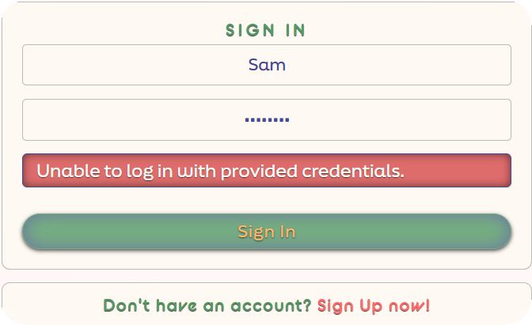

#### Sign In with Success

    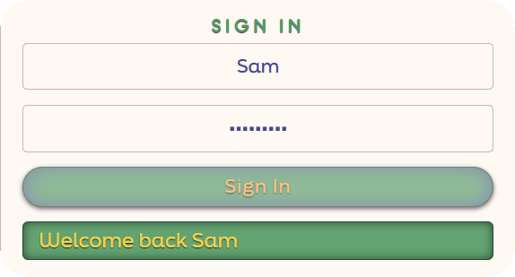
  

#### Sign Up with Common password

    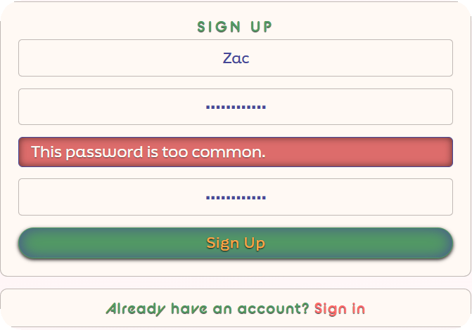
  

#### Sign Up with Passwords Mismatch

  

    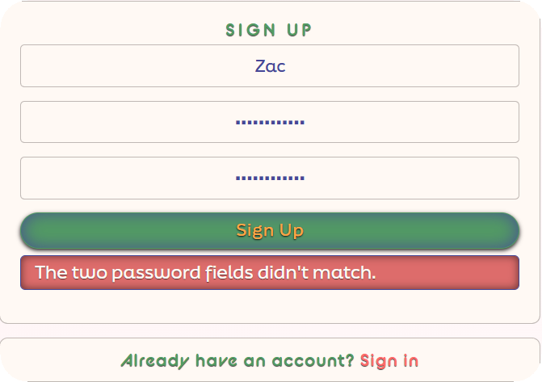
  

#### Sign Up with Success

  

  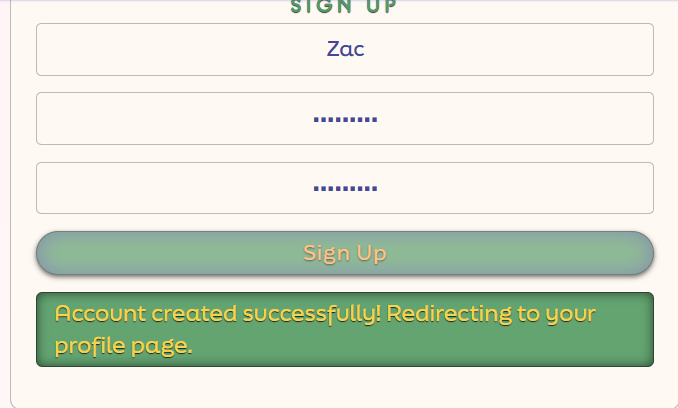

#### 🟢 Success & Warning Alerts

ArtifexLab uses a **custom React component** called **FieldAlerts**, which extends the functionality of Bootstrap’s built-in `<Alert>` component.
This approach gives developers greater flexibility to control the styling, visibility, and type of feedback displayed throughout the site.

**FieldAlerts** appear across multiple pages, offering instant user feedback for actions such as:

- Submitting or editing artworks and tutorials
- Deleting content
- Updating profile information

Distinct color styling differentiates success, warning, and error alerts for better accessibility and readability.

#### 🚫 404 Page

ArtifexLab includes a custom **404 Page Not Found** featuring the project’s signature Eye artwork.
Even when something goes wrong, the site maintains consistent branding and creative flair.

  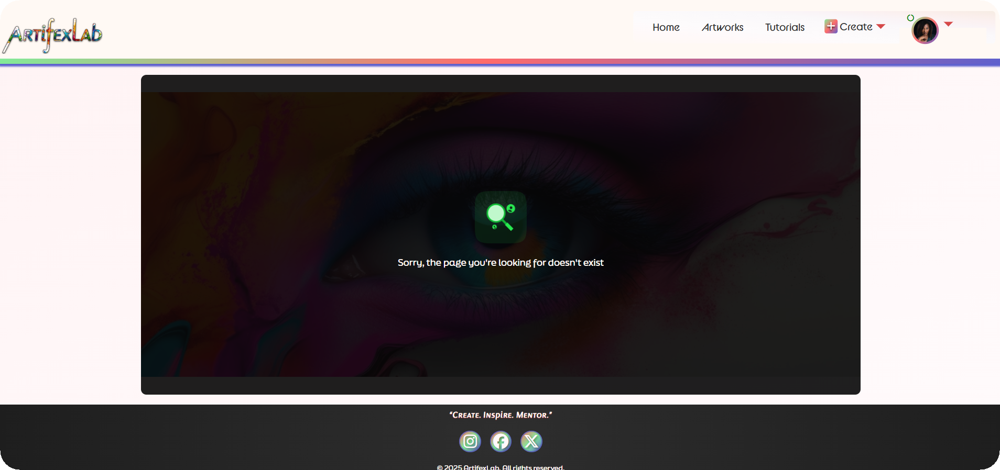

🔵⬆️ [**Back to top**](#-table-of-contents)

---

### ♻️ Reusable Components

- Consistent **form patterns**, global styling, and optional infinite scrolling for feeds.

🔵⬆️ [**Back to top**](#-table-of-contents)

---

## 🧩 Frontend Architecture

### 🗺️ Routes

| Path                  | Purpose         |
| --------------------- | --------------- |
| `/`                   | Home            |
| `/artworks/`          | Artwork list    |
| `/artworks/:id`       | Artwork detail  |
| `/artworks/:id/edit`  | Edit artwork    |
| `/tutorials/`         | Tutorials list  |
| `/tutorials/:id`      | Tutorial detail |
| `/tutorials/:id/edit` | Edit tutorial   |
| `/profiles/:id`       | Profile detail  |
| `/profiles/:id/edit`  | Profile edit    |
| `*`                   | Page Not Found  |

#### Query Parameters (Filtering, Search & Ordering)

The Artworks and Tutorials list views support URL query parameters:

- **Search**: `?search=<keyword>`
- **Ordering**: `?ordering=-created_at` (newest first) or `?ordering=created_at` (oldest first)
- **Following-only** (frontend filter → mapped to API params as implemented): e.g. `?owner__followed_by=<current_user_id>`
- **Liked-only** (Artworks): e.g. `?likes__owner=<current_user_id>`

**Examples**

- `/artworks/?search=portrait&ordering=-created_at`
- `/tutorials/?search=brush&ordering=-created_at`

### ⚙️ Components & Pages

- Clear separation between **pages (views)** and **reusable components** like Navbar, FieldAlerts, and SidePanel.
- Each section imports styling from modular CSS for maintainability.

### 🧠 State & Forms

- Local component state manages form fields.
- Validation and visual feedback via **FieldAlerts**.

### 🌐 Networking

- **Axios** instance handles API requests to the DRF backend with authentication headers preconfigured.

🔵⬆️ [**Back to top**](#-table-of-contents)

---

## 🔗 API Integration

- **Backend:** Django REST Framework using **dj-rest-auth + JWT**.
- **API Base URL (production):** `https://artifexlab-api-d4e6d81a8b08.herokuapp.com/`
- **Environment variable (frontend build):**
- REACT_APP_API_BASE_URL=https://artifexlab-api-d4e6d81a8b08.herokuapp.com/
- **Filtering / Searching / Ordering:** via query params (e.g., `?search=portrait`, `?ordering=-created_at`).
- **Pagination:** DRF pagination consumed by infinite scroll / “Load more”.
- **Dates:** human-friendly times (e.g., `naturaltime`).

**Related backend documentation:**

- Backend **README** — models & endpoints overview: **[artifexlab-api README](https://github.com/SamAtkinsonModeste/artifexlab-api)**
- **DEPLOYMENT.md** (backend) — production setup: **[Deployment](https://github.com/SamAtkinsonModeste/artifexlab-api/blob/main/DEPLOYMENT.md)**
- **AGILE.md** (backend) — planning and sprint notes: **[Agile](https://github.com/SamAtkinsonModeste/artifexlab-api/blob/main/AGILE.md)**

> Frontend-specific testing is documented in **[TEST.md](./TEST.md)**.

🔵⬆️ [**Back to top**](#-table-of-contents)

---

## 🛠️ Tech Stack

- ⚛️ **React** (Create React App)
- 🧭 **React Router**
- 💅 **React Bootstrap** + Bootstrap utility classes
- 🌍 **Axios** for API calls
- 🐙 **GitHub** for version control & project management
- ☁️ **Heroku** for deployment

🔵⬆️ [**Back to top**](#-table-of-contents)

---

## 🧪 Testing

A brief summary of key test areas is below.
🔎 Full Lighthouse, W3C HTML/CSS validation screenshots, and detailed test cases live in **[TEST.md](./TEST.md)**.

### ✅ Manual Testing

- Navigation: verified all routes load and redirect correctly.
- Auth: signup, login, logout tested end-to-end.
- CRUD: create, edit, and delete Artworks and Tutorials.
- Forms: validation errors display accurately.
- Responsiveness: tested on mobile, tablet, and desktop.
- 404 Handling: unknown routes redirect to custom 404 page.

### 🌐 Devices & Browsers

| Device  | Browser                    | Result |
| ------- | -------------------------- | ------ |
| Desktop | Chrome, Firefox, Edge      | ✅     |
| Mobile  | iOS Safari, Android Chrome | ✅     |

**Pass Criteria:**
All main user flows work correctly, no blocking console errors, and the frontend targets the correct API.

🔵⬆️ [**Back to top**](#-table-of-contents)

---

## 🧭 Known Issues & Future Enhancements

### 🐛 Known Issues (current)

- **Resource-level 404:** When a valid route includes a non-existent ID (e.g., `/artworks/999`), the view may not always fall back to the custom 404 component.

### 🌱 Future Enhancements

- **Profile Tutorials Integration:** Display a user’s created tutorials on their Profile alongside artworks.
- **Tutorial steps — text editing:** Add inline editing for step text (currently, step images can be replaced/removed and steps can be deleted/re-created).
- **Feed page:** Add a personalised feed combining content from followed artists.
- **Filter bar expansions:** Add dropdown sorting (Most Liked / Most Recent) and “Followed only” toggle where applicable.
- **Footer (mobile refinements):** Optional stacked layout variant if future content grows.
- **Tutorial media:** Support for short video clips; export tutorials as downloadable PDFs.

🔵⬆️ [**Back to top**](#-table-of-contents)

---

## 🌀 Agile Process

- **Methodology:** Agile with **MoSCoW** prioritisation and iterative delivery.
- **Tracking:** GitHub Projects board for issues, epics, and story states.
  View the live board: **[Frontend Project](https://github.com/users/SamAtkinsonModeste/projects/20/views/1)**
- **Commits:** Conventional Commits for clarity (feat/fix/docs/refactor).

For the complete backlog, sprint notes, and acceptance criteria, see the backend Agile log:
**[AGILE.md (backend)](https://github.com/SamAtkinsonModeste/artifexlab-api/blob/main/AGILE.md)**

🔵⬆️ [**Back to top**](#-table-of-contents)

---

## 💖 Credits

Heartfelt thanks to:

- 🧑‍🏫 **Rory Patrick Sheridan** — mentor for Projects 1–4
- 🧑‍💻 **Richard Wells** — mentor for Project 5 (final)
- 👨‍👩‍👧‍👦 **My family, especially my kids** — for their patience when mummy wasn’t as available ❤️

**Libraries & Tools:** React, React Router, Bootstrap/React Bootstrap, Axios, Heroku.
**Inspiration:** adapted patterns from the Code Institute **Moments** walkthrough.

🔵⬆️ [**Back to top**](#-table-of-contents)
