# 🧪 ArtifexLab Frontend — TESTING

A summary of the testing strategy, scenarios, results, and known issues for the **ArtifexLab** frontend (React).
Backend tests and API details are documented in the backend repo.

- Live site: https://artifexlabs-21d35e2775bc.herokuapp.com/
- API: https://artifexlab-api-d4e6d81a8b08.herokuapp.com/
- Frontend repo: https://github.com/SamAtkinsonModeste/artifexlab
- Backend repo: https://github.com/SamAtkinsonModeste/artifexlab-api

---

📘 Return to main documentation: **[README.md](./README.md)**

---

## 📋 Table of Contents

1. [Test Environment](#test-environment)
2. [Test Accounts](#test-accounts)
3. [Test Scope & Strategy](#test-scope--strategy)
4. [Manual Test Matrix](#manual-test-matrix)
   - [Navigation](#navigation)
   - [Authentication](#authentication)
   - [Artworks](#artworks)
   - [Tutorials](#tutorials)
   - [Profile](#profile)
   - [Followers Component](#followers-component)
   - [Filters & Search](#filters--search)
   - [Feedback & Errors](#feedback--errors)
   - [404 Handling](#404-handling)
5. [Responsive & Devices](#responsive--devices)
6. [Browsers](#browsers)
7. [Accessibility](#accessibility)
8. [Performance](#performance)
9. [Bug Log & Resolutions](#bug-log--resolutions)
10. [Screenshots & Evidence](#screenshots--evidence)
11. [Deployment Verification](#deployment-verification)
12. [Pass Criteria](#pass-criteria)

---

## 🧪 Test Environment

- **Frontend**: React (CRA) + React Router + React Bootstrap
- **API**: Django REST Framework + dj-rest-auth (JWT)
- **Production**: Heroku (frontend + API)
- **Env var**: `REACT_APP_API_BASE_URL=https://artifexlab-api-d4e6d81a8b08.herokuapp.com/`

---

## 👤 Test Accounts

Use a non-admin account for standard user journeys.

| Role  | Username   | Password | Notes                |
| ----- | ---------- | -------- | -------------------- |
| User  | `testuser` | `••••••` | Standard permissions |
| Admin | (optional) |          | For API/admin only   |

> Replace with throwaway credentials used in testing.

---

## 🧭 Test Scope & Strategy

- **Focus**: Core user journeys (Auth, CRUD, Filters), visual responsiveness, accessibility cues, and error handling.
- **Method**: Manual testing with documented steps + screenshots.
- **Out of scope**: Automated unit/e2e tests (future).

---

## ✅ Manual Test Matrix

### Navigation

| Scenario                          | Steps                                       | Expected                               | Result |
| --------------------------------- | ------------------------------------------- | -------------------------------------- | ------ |
| Global nav links                  | Click **Home**, **Artworks**, **Tutorials** | Page loads, active state visible       | ✅     |
| Mobile menu                       | Toggle hamburger, select links              | Menu opens, links fade-in, correct nav | ✅     |
| Create/Profile dropdowns (authed) | Log in → open dropdowns                     | Options visible; routes correct        | ✅     |

### Authentication

| Scenario                     | Steps                | Expected                            | Result |
| ---------------------------- | -------------------- | ----------------------------------- | ------ |
| Sign Up – password too short | Submit weak/mismatch | Inline warnings via **FieldAlerts** | ✅     |
| Sign Up – success            | Valid inputs         | Success alert; redirected/logged in | ✅     |
| Sign In – wrong password     | Wrong creds          | `non_field_errors` alert displayed  | ✅     |
| Sign In – success            | Correct creds        | Redirect to home; state updated     | ✅     |
| Sign Out                     | Use dropdown         | Session cleared; redirected         | ✅     |

### Artworks

| Scenario           | Steps                   | Expected                       | Result |
| ------------------ | ----------------------- | ------------------------------ | ------ |
| Create             | Add title+image+desc    | Success alert; visible in list | ✅     |
| Edit own artwork   | Update fields           | Changes persist; success alert | ✅     |
| Delete own artwork | Confirm delete          | Removed from list; alert       | ✅     |
| Like & comment     | Interact as authed user | Counts update; feedback shown  | ✅     |

### Tutorials

| Scenario        | Steps                       | Expected                         | Result |
| --------------- | --------------------------- | -------------------------------- | ------ |
| Create tutorial | Title, desc, feature image  | Success; visible in list/detail  | ✅     |
| Add steps       | Add text (+ optional image) | Steps appended; previews visible | ✅     |
| Edit tutorial   | Update main fields          | Changes persist; success alert   | ✅     |
| Delete step     | Remove one step             | Step removed; alert              | ✅     |
| Delete tutorial | Remove full tutorial        | Redirect; success alert          | ✅     |

> Current limitation: step **text** not editable inline (tracked in Future Enhancements).

### Profile

| Scenario                 | Steps                 | Expected                          | Result |
| ------------------------ | --------------------- | --------------------------------- | ------ |
| View own profile         | Go to `/profiles/:id` | Avatar + stats + artworks list    | ✅     |
| Edit profile             | Update avatar/bio     | Profile updates; alert            | ✅     |
| Change username/password | Use dropdown options  | Success alerts; re-auth if needed | ✅     |

### Followers Component

| Scenario        | Steps                            | Expected                      | Result |
| --------------- | -------------------------------- | ----------------------------- | ------ |
| Visibility      | Visit Artworks/Tutorials/Profile | Side panel present            | ✅     |
| Follow/unfollow | Click button on other users      | Button toggles; counts update | ✅     |
| Self hidden     | Own row has no follow button     | No follow button for self     | ✅     |

### Filters & Search

| Scenario              | Steps                | Expected                        | Result |
| --------------------- | -------------------- | ------------------------------- | ------ |
| Search                | Type keyword         | Results filtered live           | ✅     |
| Ordering              | Choose newest/oldest | List reorders accordingly       | ✅     |
| Following-only        | Toggle filter        | Only followed creators’ content | ✅     |
| Liked-only (Artworks) | Toggle filter        | Only liked artworks             | ✅     |

### Feedback & Errors

| Scenario                    | Steps                           | Expected                  | Result |
| --------------------------- | ------------------------------- | ------------------------- | ------ |
| FieldAlerts – success       | Perform create/edit/delete      | Success alert appears     | ✅     |
| FieldAlerts – warning/error | Trigger validation/server error | Warning/error alert shows | ✅     |
| 404 page                    | Visit unknown route             | Custom 404 renders        | ✅     |

---

## 📊 Lighthouse Scores

Add your screenshots for **mobile** and **desktop** here. Each section is collapsible to keep the README tidy.

  
<strong>🏠 Home — Lighthouse</strong>

  

    <em>Mobile</em> 
    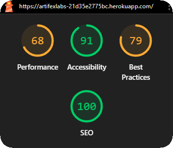
  

  

    <em>Desktop</em> 
    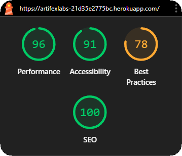
  

  
<strong>🎨 Artworks — Lighthouse</strong>

  

    <em>Mobile</em> 
    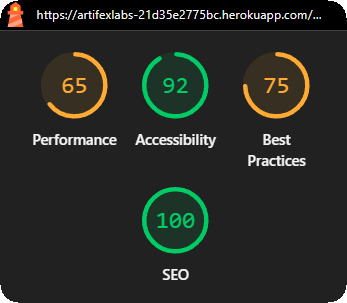
  

  

    <em>Desktop</em> 
    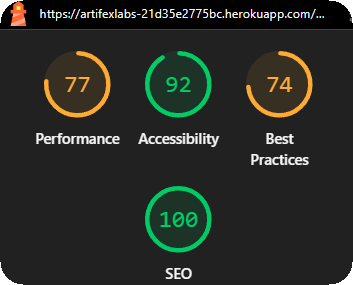
  

  
<strong>📚 Tutorials — Lighthouse</strong>

  

    <em>Mobile</em> 
    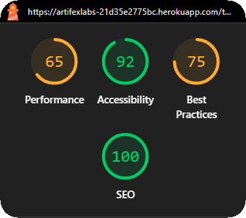
  

  

    <em>Desktop</em> 
    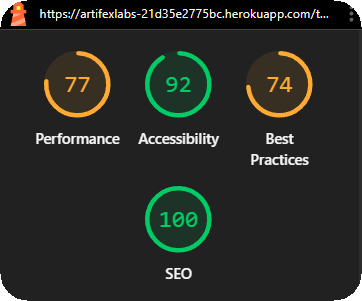
  

🔵⬆️ [**Back to top**](#-table-of-contents)

## ✅ HTML Validation (W3C)

Screenshots showing **valid HTML** for each key route.

  
<strong>🏠 Home — HTML Validator</strong>

  

    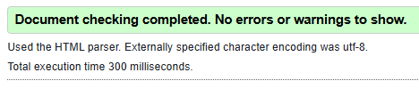
  

  
<strong>🎨 Artworks — HTML Validator</strong>

  

    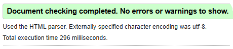
  

  
<strong>📚 Tutorials — HTML Validator</strong>

  

    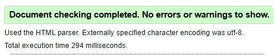
  

🔵⬆️ [**Back to top**](#-table-of-contents)

## 🎨 CSS Validation (W3C)

Screenshots showing **valid CSS** results.

  
<strong>🏠 Home — CSS Validator</strong>

  

    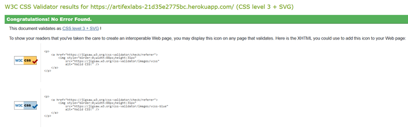
  

  
<strong>🎨 Artworks — CSS Validator</strong>

  

    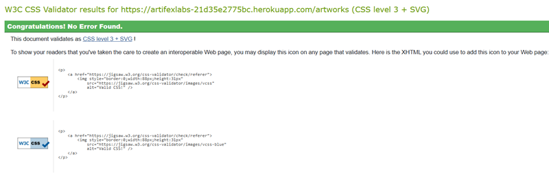
  

  
<strong>📚 Tutorials — CSS Validator</strong>

  

    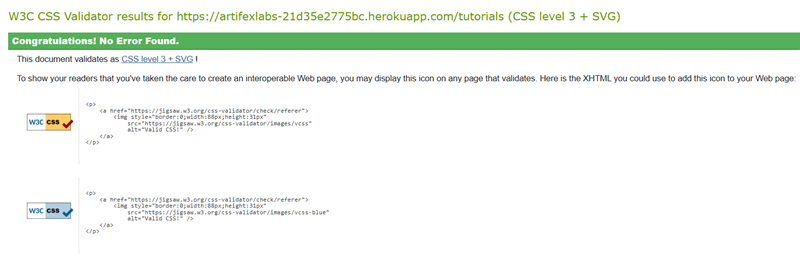
  

🔵⬆️ [**Back to top**](#-table-of-contents)

## 📱 Responsive & Devices

Breakpoints verified:

- Mobile (≤ 576px), Phablet (576–768px), Tablet (768–992px), Desktop (≥ 992px)

Devices:

| Device         | Result | Notes |
| -------------- | ------ | ----- |
| iPhone SE      | ✅     |       |
| iPhone 12/14   | ✅     |       |
| Pixel 6        | ✅     |       |
| iPad           | ✅     |       |
| Desktop 1440px | ✅     |       |

**Am I Responsive** screenshot used in README hero:
`docs/images/responsive-image.png`

---

## 🌐 Browsers

| Browser    | Version | Result | Notes |
| ---------- | ------- | ------ | ----- |
| Chrome     | Latest  | ✅     |       |
| Firefox    | Latest  | ✅     |       |
| Edge       | Latest  | ✅     |       |
| Safari iOS | Latest  | ✅     |       |

---

## ♿ Accessibility

Checklist (WCAG-inspired):

- ✅ Color contrast passes for text/buttons (brand palette)
- ✅ Keyboard navigation: focus rings visible, tab order logical
- ✅ Semantic landmarks: header/nav/main/footer
- ✅ Form labels associated (`controlId`/`htmlFor`)
- ✅ Alerts announced (role `alert` from Bootstrap)
- ✅ Link names meaningful (avoid “click here”)
- ✅ Images with `alt` text (decorative images `alt=""`)

> Optional: include Lighthouse Accessibility score.

---

## ⚡ Performance

- ✅ Images optimized/compressed (hero/feature/tutorial images)
- ✅ No blocking console errors in production build
- ✅ API calls batched or debounced where appropriate
- ✅ Lighthouse Performance/Best Practices run on Home, Artworks, Tutorials

---

## 🐞 Bug Log & Resolutions

| ID     | Description                        | Status   | Fix                                                                     |
| ------ | ---------------------------------- | -------- | ----------------------------------------------------------------------- |
| FE-001 | Login error not shown on bad creds | ✅ Fixed | Rendered `errors.non_field_errors` via `FieldAlerts`; cleared on change |

---

## 📷 Screenshots & Evidence

Use collapsible sections to keep the document tidy.

  
<strong>Authentication</strong>

- Sign Up – password mismatch: `docs/images/passwords-not-match.png`
- Sign In – bad credentials: `docs/images/signin-form.png`
- Sign In – success toast: `docs/images/welcome-back.png`

  
<strong>Artworks</strong>

- Create form: `docs/images/upload-artwork.png`
- List view: `docs/images/listview-artwork.png`
- Detail: `docs/images/artwork-detail.png`

  
<strong>Tutorials</strong>

- Create: `docs/images/tutorial-form.png`
- Add step: `docs/images/tutorial-step-form.png`
- Detail: `docs/images/tutorial-detail.png`
- Edit steps: `docs/images/tutorial-steps.png`

  
<strong>Profile & Followers</strong>

- Profile header: `docs/images/profile-head.png`
- Profile artworks: `docs/images/profile-artwork.png`
- Followers panel: `docs/images/followers-panel.png`

  
<strong>Filters & Search</strong>

- Artworks filters: `docs/images/filterbar-artworks.png`
- Tutorials filters: `docs/images/filterbar-tutorials.png`

  
<strong>404 & Footer</strong>

- 404 page: `docs/images/pageNotFound.png`
- Footer: `docs/images/footer-desktop.png`

---

## 🚀 Deployment Verification

Post-deploy checks (production):

- ✅ App loads over **HTTPS**
- ✅ API requests target **production API base URL**
- ✅ Auth: Sign Up / Sign In / Sign Out work
- ✅ CRUD: Artworks & Tutorials work end-to-end
- ✅ Filters/Search: return expected results
- ✅ No blocking console errors
- ✅ Meta/title present; favicon loads

---

## ✅ Pass Criteria

- All primary user journeys complete without error (Auth, CRUD, Filters, Profile).
- No blocking console errors in production.
- UI responsive and accessible with visible focus.
- Frontend configured to hit the correct production API base URL.

---

📘 Return to main documentation: **[README.md](./README.md)**
